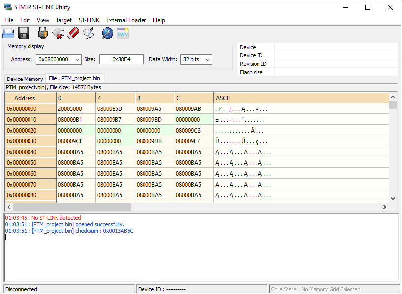
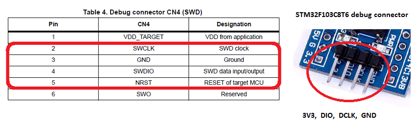
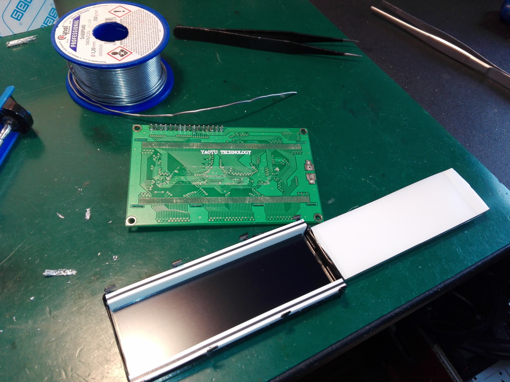
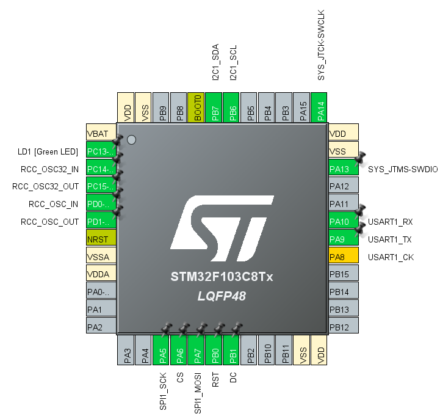
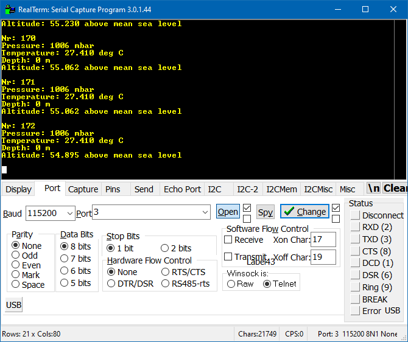

# PTM project 2020/2021

## [Idea:](https://i.pinimg.com/originals/77/ce/37/77ce3786d5a035243790f7168da7b3c5.jpg)

We are the members of the scientific association working on the [PWr Diving Crew](http://robocik.pwr.edu.pl/) research project.

We are involved in building an AUV class underwater robot - BlueNemo.

Currently, preparing for international competitions, we are working on a new vehicle, for which we are preparing support for the following sensors:

* AHRS (IMU module with internal processing and filtration),
* Bar02 diigtal pressure and temperature sensor, which among others allows for depth estimation.

We will also use LCD screen as a control/reading panel (eventually it could be OLED screen), which will be located inside the robot.

____

The project will focus on supporting the following things:

* screen **Nokia 5110** (84x48 px).
  * communication protocol: **SPI**,
  
  * the library was written from scratch using information from the catalog note,
  
  * [product page](https://botland.com.pl/wyswietlacze-alfanumeryczne-i-graficzne/2650-wyswietlacz-lcd-graficzny-84x48px-nokia-5110-niebieski.html),
  
  * [documentation](https://botland.com.pl/index.php?controller=attachment&id_attachment=552),
  
    
  
* sensor **Bar02**:
  
  * it is high quality MEMS based sensor with integrated 24-bit ΔΣ ADC ,
  
  * operating range: 300 to 1,200 mbar, -20 to +85 °C,
  
  * communication protocol: **I2C** (0x76),
  
  * [product page](https://bluerobotics.com/store/sensors-sonars-cameras/sensors/bar02-sensor-r1-rp/?fbclid=IwAR1OrarpIVQRmMD04arDhxaLX52zNftKDEgKdB-qMfzaiU9inliZ1wjkOcQ),
  
  * [datasheet of MS5837-02BA](https://www.te.com/commerce/DocumentDelivery/DDEController?Action=srchrtrv&DocNm=MS5837-02BA01&DocType=Data+Sheet&DocLang=English&DocFormat=pdf&PartCntxt=CAT-BLPS0059).
  
    
  
* screen **YM2004A** 20x4 LCD:
  
  * [PCF8574](https://www.nxp.com/docs/en/data-sheet/PCF8574_PCF8574A.pdf) - additional 8bit I/O expander for I2C-bus
  * communication protocol: **I2C** (0x27),
  * [datasheet of YM-2004A](https://www.evselectro.com/image/data/datasheet/YM2004A.pdf),


## Hardware:

The **Nucleo F103RB** evaluation board will be used as a test software and debugging tool.

Ultimately the code will be ported to **"[Bluepill](https://os.mbed.com/users/hudakz/code/STM32F103C8T6_Hello/)"** ([STM32F103C8T6](https://www.st.com/resource/en/datasheet/stm32f103c8.pdf)).

## Software:

* libraries: **HAL**
* IDE: **STM32 Cube IDE** v:1.6.1
* **RealTerm** v:3.0.1
## Authors/developers:

- [@PanPeople](https://github.com/PanPeople) (Mikołaj Czerniak)
- [@Dako99](https://github.com/Dako99) (Damian Kociołek)


## Current functions:

- LCD library:
  - buffer refresh,
  
  - drawing a pixel,
  
  - caption generation,
  
  - loading tables with full buffer,
  
  - drawing of bitmaps.
  
- BAR02 library:

  - quick model type set,
  - reading the value of pressure and temperature,
  - calculating depth and relative altitude from given data,
  - cyclic redundancy check (CRC).
## Problems and workarounds:
- flashing of fake **Bluepill**:

  > [useful links](https://os.mbed.com/users/hudakz/code/STM32F103C8T6_Hello/)
  >
  > The software used was `STM32 ST-LINK Utility`.
  >
  >  
  >
  >  
  
- problems with 20x4 LCD

  
  
  > Purchased LCD display module turned out to be defective. Backlight LED had a changed anode with cathode so a minor soldering was required for the correct operation of the module.
## Future ideas:

- Better integration with the other sensors used in the AUV.
  
- Greater integration with Timers.
  
- Reading converted bitmaps from SD (with another SPI interface) card to open movie.
  
  >   
  >
  > "Bad apple" 48x84 pixels resolution
## Branch description

#### Nokia screen branch


| Name      | Owner     | Description              |
| :-------- | :------- | :------------------------- |
| `lcd_PanPeople` | `PanPeople` |Base code for Nokia 5110 screen |

All required library files are in ` lcd_5110_library `folder. 

`lcd_5110.h` is a header file which consist few essential defines:

>Resolution of used display
>
>```C
>#define LCD_X 84
>#define LCD_Y 48
>```
>
>____
>
>Macro for passing **command** or **data** to the display
>
>```C
>#define LCD_C GPIO_PIN_RESET//<- command
>#define LCD_D GPIO_PIN_SET// <- data
>```
>
>Declaration of used pins
>
>```C
>#define LCD_DC_PIN GPIO_PIN_1
>#define LCD_CE_PIN GPIO_PIN_6
>#define LCD_RST_PIN GPIO_PIN_0
>
>#define LCD_DC_PORT GPIOB
>#define LCD_CE_PORT GPIOA
>#define LCD_RST_PORT GPIOB
>```
>
>- **RST** - A line that resets the display registers. Before operating the display, generate a zero state on this line for at least 100ns. During normal display operation, there should be a continuous high state on this line.
>- **CE** - is the CS line of the SPI interface, the name comes from *Chip Enable*
>- **DC** - line determining whether we send data (high state) or commands for the display (low state)

`lcd_5110.c` main library file with:

> Spark fun font  table which contains the hex values that represent pixels for a font that is 5 pixels wide and 8 pixels high (Beerware license)
>
> ```c
> const uint8_t font_ASCII[][5] = {
> {0x00, 0x00, 0x00, 0x00, 0x00} // 20
> ,{0x00, 0x00, 0x5f, 0x00, 0x00} // 21 !
> ,{0x00, 0x07, 0x00, 0x07, 0x00} // 22 "
> ,{0x14, 0x7f, 0x14, 0x7f, 0x14} // 23 #
> ,{0x24, 0x2a, 0x7f, 0x2a, 0x12} // 24 $
> //... more data in code ...
> };
> ```
>
> ____
>
> PWr Diving Crew bitmap logo
>
> ```C
> const uint8_t logo []=
> {
> 0x00, 0x00, 0x00, 0x00, 0x00, 0x00,
> //... more data in code ...
> };
> ```
>
> ____
>
> Function for initializing communication with the screen and additional command for setting contrast
>
> parameters:
>
> > `SPI_HandleTypeDef *spi` - handler for SPI structure (can be found in spi.c)
>
> ```C
> void LCD_Initialize(SPI_HandleTypeDef *spi);
> ```
>
> ____
>
> Function for sending a command, all commands code (binary values) are available in documentation
>
> parameters:
>
> > `SPI_HandleTypeDef *spi` - handler for SPI structure (can be found in spi.c)
> >
> > `uint8_t cmd`- command as hexadecimal value
>
> ```C
> void LCD_Command(SPI_HandleTypeDef* spi,uint8_t cmd);
> ```
>
> ____
>
> Function for sending data, in this library it is used for pushing whole data buffer
>
> parameters:
>
> > `SPI_HandleTypeDef *spi` - handler for SPI structure (can be found in spi.c)
> >
> > `uint8_t cmd`- used for sending whole buffer of data
>
> ```C
> void LCD_Data(SPI_HandleTypeDef *spi,uint8_t* cmd);
> ```
>
> ____
>
> Kinda useless function but it is used for sending just one byte of data,(may be used function in *for* loop for example to fill whole screen or make it blank)
>
> parameters:
>
> > `SPI_HandleTypeDef *spi` - handler for SPI structure (can be found in spi.c)
> >
> > `uint8_t cmd`- used for sending whole buffer of data
>
> ```C
> void LCD_Data_Byte(SPI_HandleTypeDef *spi,uint8_t* cmd);
> ```
>
> ____
>
> Function is used to clear whole screen, NOT buffer, can be handy in flashing animations
>
> parameters:
>
> > `SPI_HandleTypeDef *spi` - handler for SPI structure (can be found in spi.c)
>
> ```C
> void LCD_Clear(SPI_HandleTypeDef *spi);
> ```
>
> ____
>
> Just filling up whole screen
>
> buffer stays untouched.
>
> parameters:
>
> > `SPI_HandleTypeDef *spi` - handler for SPI structure (can be found in spi.c)
>
> ```C
> void LCD_Fill(SPI_HandleTypeDef *spi)
> ```
> > ____
>
> Filling up buffer with shifting bit magic
>
> parameters:
>
> > `uint8_t buffer[]` - buffer of hexadecimal pixel data
> >
> > `uint8_t x` - horizontal position of pixel
> >
> > `uint8_t y` - vertical position of pixel
>
> ```C
> void LCD_draw_pixel(uint8_t buffer[],uint8_t x, uint8_t y);
> ```
> > ____
>
> Just clearing the buffer data
>
> parameters:
>
> > `uint8_t buffer[]` - buffer of hexadecimal pixel data
>
> ```C
> void LCD_Clear_Buffer(uint8_t buffer[]);
> ```
> > ____
>
> Putting text character into buffer array:
>
> parameters:
>
> > `int row` - row of the text
> >
> > `int col` - column of the text
> >
> > `const char* text` - just your text
> >
> > `uint8_t buffer[]` - 
>
> ```C
> void lcd_draw_text(int row, int col, const char* text,uint8_t buffer[]);
> ```


#### Bar02 sensor branch


| Name      | Owner     | Description              |
| :-------- | :------- | :------------------------- |
| `bar_Dako99` | `Dako99` | Base code for communication with Bar02 sensor |

`MS5837.h` is a header file which consist few essential defines:


> Simple description of function
>
> parameters:
>
> > `uint8_t i` - some variable
>
> ```C
> uint8_t MS5837_init(I2C_HandleTypeDef *hi2c);
> ```
> > ____


> Change between BAR02 and BAR30
>
> parameters:
>
> > `uint8_t model` - sensor model
>
> ```C
> 	void MS5837_setModel(uint8_t model);
> ```
> > ____

> Set constant value of density
>
> parameters:
>
> > `float density` - value of fluid density
>
> ```C
> 	void MS5837_setFluidDensity(float density);
> ```
> > ____

> Read data
>
> parameters:
>
> > none
>
> ```C
> 	void MS5837_read();
> ```
> > ____

> Read measured pressure
>
> parameters:
>
> > `float conversion` - pressure unit conversion
>
> ```C
> 	float MS5837_pressure(float conversion);
> ```
> > ____

> Read measured temperature
>
> parameters:
>
> > `uint8_t i` - some variable
>
> ```C
> 	float MS5837_temperature();
> ```
> > ____

> Read measured depth
>
> parameters:
>
> > `uint8_t i` - some variable
>
> ```C
> 	float MS5837_depth();
> ```
> > ____

`lcd_i2c.h` is a header file which consist few essential defines:

> Write to LCD function
>
> parameters:
>
> > `uint8_t addr` - address
> >
> > `uint8_t data` - 4 element array 
> >
> > `uint8_t xpin` - some variable
>
> ```C
> void lcd_write(uint8_t addr, uint8_t data, uint8_t xpin)
> ```
>
> > ____

> LCD display initialisation with structure
>
> parameters:
>
> > `struct lcd_disp * lcd` - some variable
>
> ```C
> void lcd_display(struct lcd_disp * lcd)
> ```
> > ____


## Used pins:

 

 

### Table of functions with descriptions of particular pins:

|   Function:   | GPIO pin: |             Additional info:              |
| :-----------: | :-------: | :---------------------------------------: |
|      CS       |    PA6    |              CS line for SPI              |
|      RST      |    PB0    |            RST line for screen            |
|      DC       |    PB1    |            DC line for screen             |
|   SPI1_SCK    |    PA5    |                     -                     |
|   SPI1 MOSI   |    PA7    |                     -                     |
|  GPIO_Output  |   PC13    | green LED for debugging/status indicating |
|   I2C1 SCL    |   PB_6    |         common Serial Clock Line          |
|   I2C1 SDA    |   PB_7    |          common Serial Data Line          |
|   UART1_TX    |   PA_9    |  for additional data transmission to PC   |
|   UART1_RX    |   PA_10   |  for additional data receivation form PC  |
| RCC_OSC32_IN  |   PC14    |              X1 8MHz crystal              |
| RCC_OSC32_OUT |   PC15    |                for PLLCLK                 |
|  RCC_OSC_IN   |    PD0    |           X2 32.768kHz crystal            |
| RCC_OSC32_OUT |    PD1    |                  for RTC                  |

## Installation:

In the repository there are two folders called `F103C8TX` and `F103RB`, just download one of the folder and lunch the project from **CubeIDE**, not tested with **Keil ** Virtual uC.

For more info search: *opening project in Cube IDE* 

For more info, just ask a question via email or Github.


## Example usage:

### `lcd_PanPeoople`

1. declare `uint8_t buffer[LCD_X*LCD_Y/8]`

2. use some kind of `uint8_t flag [3] = {0,0}` with interrupt to:

   1. `flag[0]` - for timer update event
   2. `flag[1]` -  buffer is ready to push/send

3. make some awesome/random stuff with `buffer[]` and `LCD_draw_pixel()`

4. send `buffer[]` with `LCD_Data()`

   

### `bar_Dako99`

1. declare address `disp.addr = (0x27 << 1);`
2. set back-light `disp.bl = true;`
3. print everything you want
   1.  In first line: `sprintf((char*)disp.f_line, "First line of text");`
   2. In second line:` sprintf((char*)disp.s_line, "Second line of text");`
   3. In third  line: `sprintf((char*)disp.t_line, "Third line of text");`
   4. In last line: ` sprintf((char*)disp.l_line, "Last line of text");`


## Our usage

### `lcd_PanPeople`

[main.c](https://github.com/PanPeople/PTM_project/blob/lcd_PanPeople/F103C8TX/PTM_project/Core/Src/main.c)

what was used:

* two flags
* timer update 


###  `bar_Dako99`

 

The program also could print parameters to PC via UART


## Licence

```
 * -----------------------------------------------------------------------------------------------
 * "THE BEER-WARE LICENSE" (Revision 42):
 * Mikołaj Czerniak and Damian Kociołek wrote this files. As long as you retain this notice you
 * can do whatever you want with this stuff. If we meet some day, and you think
 * this stuff is worth it, you can buy us a beer in return Mikołaj Czerniak and Damian Kociołek
 * -----------------------------------------------------------------------------------------------
```

## Lorem Ipsum

Class aptent taciti sociosqu ad litora torquent per conubia nostra, per inceptos himenaeos. Praesent hendrerit, tellus sed condimentum **placed** pharetra, justo ipsum interdum felis, at laoreet erat lorem sed nibh. Aenean sodales odio at blandit ultricies. Nullam et suscipit mauris. Morbi et diam felis. Curabitur nec ante id neque imperdiet semper. Donec **just** hendrerit, libero ut fringilla ultrices, est nibh imperdiet arcu, id hendrerit neque felis euismod tellus. Nam faucibus erat id ultrices tempor. Orci varius natoque penatibus **for** et magnis dis parturient montes, **fun** nascetur ridiculus mus. Integer ut cursus est, vel pharetra dolor. Cras sit amet dapibus nunc. Morbi bibendum maximus justo, vitae consequat nibh ultricies nec. Etiam luctus, arcu cursus feugiat viverra, enim mauris ornare orci, et efficitur lacus sem eu lorem. Fusce risus eros, cursus sed arcu ut, tempor tincidunt nunc.

