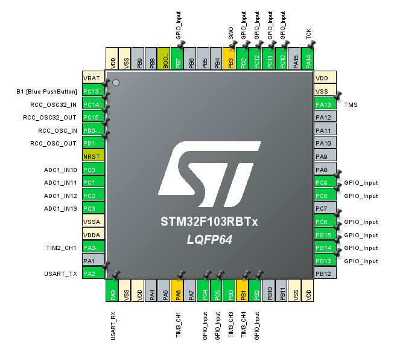

# Projekt PTM

Projekt skupiać się będzie na obsłudze następujących elementów:
* ekran **Nokia 5110** (84x48 px)
    * protokół komunikacji: **SPI**
    * biblioteka będzie napsiana od zera przy pomocy informacji z noty katalogowej
    * [strona produktu](https://botland.com.pl/wyswietlacze-alfanumeryczne-i-graficzne/2650-wyswietlacz-lcd-graficzny-84x48px-nokia-5110-niebieski.html)

* czunnik **Bar02**:
    * [strona produktu](https://bluerobotics.com/store/sensors-sonars-cameras/sensors/bar02-sensor-r1-rp/?fbclid=IwAR1OrarpIVQRmMD04arDhxaLX52zNftKDEgKdB-qMfzaiU9inliZ1wjkOcQ)
    * [Datasheet](https://www.te.com/commerce/DocumentDelivery/DDEController?Action=srchrtrv&DocNm=MS5837-02BA01&DocType=Data+Sheet&DocLang=English&DocFormat=pdf&PartCntxt=CAT-BLPS0059)
    * jest to czunik rezystancyjny (wykorzystanie ADC)

## Hardware

Wykorzystana zostanie płytka ewaluacyjna **Nucleo F103RB** oraz **"Bluepill"**

## Software

* biblioteki: **HAL**
* IDE: **Cube IDE**
## Autorzy

- [@PanPeople](https://github.com/PanPeople)
- [@Dako99](https://github.com/Dako99)

## Aktuane funkcje:

- work in progress

  
## Opis branchy

#### Nokia screen branch

| Name      | Owner     | Description              |
| :-------- | :------- | :------------------------- |
| `screen_dev` | `PanPeople` |Base code for Nokia 5110 screen |

#### Bar02 sensor branch

| Name      | Owner     | Description              |
| :-------- | :------- | :------------------------- |
| `bar_dev` | `Dako99` | Base code for Bar02 sensor |

## Wykorzystane piny:

 

### Opis poszczególnych wyprowadzeń:

| GPIO pin: | Function: | Additional info: |
| --------- | --------- | --------------------- |
| PA1       | none      | none                  |
|           |           |                       |
|           |           |                       |

